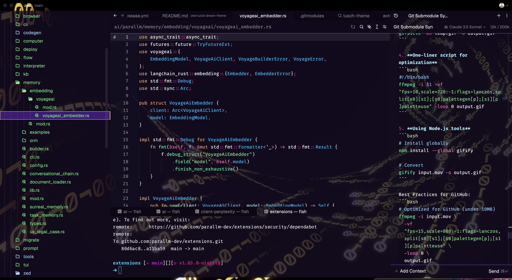

# zed-lucid-dream-theme

A semi-transparent dark theme for [Zed](https://github.com/zed-industries/zed). I enjoy video wallpaper behind code.

Place `lucid-dream.json` in `~/.config/zed/themes`, restart Zed and select it from the command palette (`Cmd+Shift+P`) or (`Cmd+K Cmd+T`).

